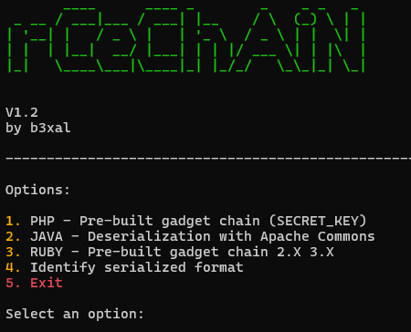

# rCeChAiN

**rCeChAiN** is a tool that facilitates the exploitation of deserialization vulnerabilities in PHP applications. It allows to generate and sign malicious cookies to execute remote code by exploiting pre-built gadget strings. It is designed to be used in security testing environments, such as CTFs or penetration tests, to attack PHP applications vulnerable to this type of exploitation.

## Features

- Automatic generation of Payloads:** It uses tools such as PHPGGC to generate serialized PHP objects containing remote code execution (RCE) payloads.
  
- **Automatic Cookie Signing:** Generates malicious cookies correctly signed using a secret key obtained from a deserialization vulnerability.
  
- **Simple Interface:** Generates payloads and cookies with a single command, which facilitates the exploitation process.

## Requirements

- Python 3.X
- PHPGGC 

## Installation

1. **Clone the repository:**

   `git clone https://github.com/B3XAL/rCeChAiN.git`

   `cd rCeChAiN`
   
2. **Install dependencies:**

   Make sure you have Python 3.x and pip installed..

   `pip install -r requirements.txt`
   
3. **Install PHPGGC:**

   `sudo apt install phpggc -y`

## Use

1. **Generate a Payload:**
   
   To generate a malicious payload and obtain the signed cookie, execute:

   `python3 rCeChAiN.py`

2. **Configuration:**

   During execution, you will be prompted to enter:
   - The secret key `SECRET_KEY` obtained from the vulnerable environment.
   - The Burp Collaborator server or the server of your choice to execute the commands.
  
     

3. **End:**

   Once the payload is generated, the cookie will be copied to the clipboard and saved in a file named `cookies.txt`. 

## Example of Use

1. **Enter SECRET_KEY y Burp Collaborator:**

   `python3 rCeChAiN.py`

   

2. **Payload generation:**
   
   - All Cookies generated will be saved in cookies.txt and copied to your clipboard.
  
   

3. **Use in Burpsuite ( Intruder ):**

   

   - Working payloads will use the payload name as a subdomain on the collaborator server, making it easier to identify the successful payload.
     
   

4. **Customization:**
   - It will ask us if any of them have been successfully exploited and if so, it will allow us to do so.
  
   
   
   1 - Data exfiltration of a particular file

   

   

   2 - Custom payload creation

   

   

   Calling the latter if successfully executed to success.burpcollaborator
   

## Contributions

If you have any improvements or suggestions, feel free to contribute! You can open an **Issue** or make a **Pull Request** with your changes.

## License

This project is under the **MIT License**. See the file [LICENSE](LICENSE) para más detalles.

---

*by b3xal*

